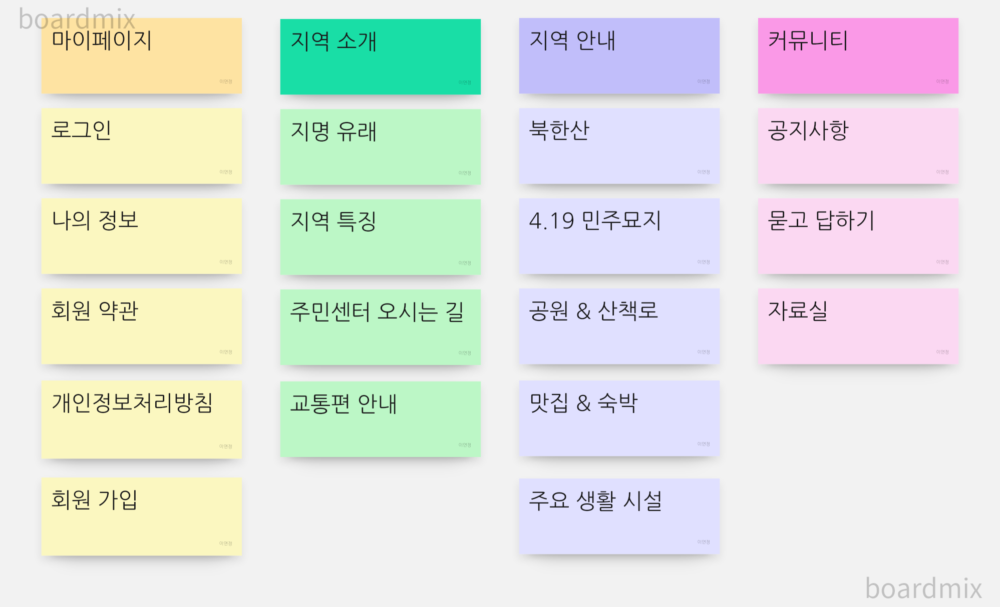
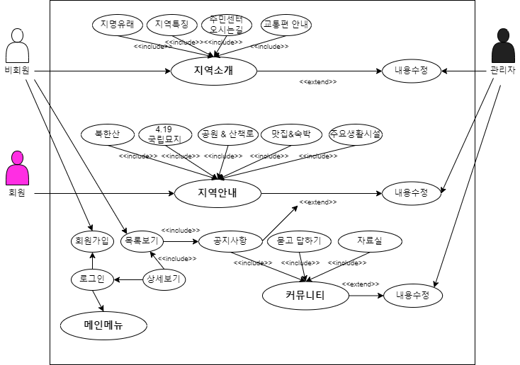
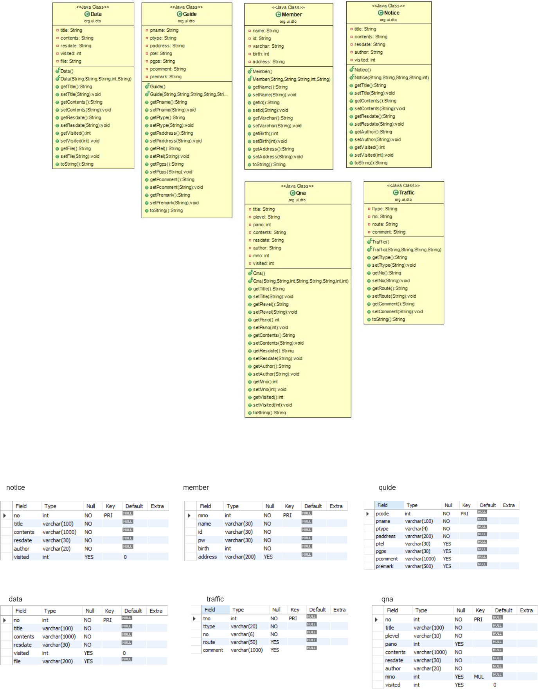

# 프로젝트 개발 보고서 (Project Development Report)
------------------------------------------------
## 1. 프로젝트 개요 (Project Outline)
    북한산 국립공원을 끼고 있으며 인근 번화가에서는 볼 수 없는 아늑함과 고요함이 배어있는 우이동을 소개하기 위한 웹 애플리케이션을 자바 기반으로 개발하게 되었다.

  

## 2. 프로젝트의 목적 (Purpose of Project)

    우이동의 역사와 특징, 동네의 명소, 주요 생활시설을 안내고 커뮤니티를 구성하므로써 다양한 정보를 한곳에서 제공하여 우이동의 매력을 많은 시민에게 알리기 위한 목적을 두고 있다.

  

## 3. 프로젝트 개발 환경 정보 (Project Development Environment)

- Project Topic : Ui-don Introduction Web Application

- Develope Environment : Open JDK 11

- Language : Java 11

- Web Module : Jsp / Servlet 3.0

- Process Pattern : MVC Pattern

- Database System(DBMS) : MySQL 8.0

- Database Design : SQL Developer 23.1.1

- Entity Relationship Design : [draw.io](http://draw.io) 20.8.16

- Java Database Connector : ojdbc11

- Application Design : Object aid 1.2.4

- Back Template Language : Java / Servlet 11

- Front Template Language : Jsp(JSTL/EL) 3.0/HTML5/CSS3/Javascript ES5

- Web (Application) Server : Tomcat 9.0

- Package Information

  

## 4. 프로젝트 기획 및 설계(Project Planning & Design)

### 4-1. 네비게이션 설계 (Navigation Design)

 
| 마이페이지 | 지역 소개 | 지역 안내 | 커뮤니티 |
|-----------|---------|------------|---------|
| 로그인 | 지명 유래 | 북한산 | 공지사항
| 나의정보 | 지역 특징 | 4.19 민주묘지 | 묻고 답하기
| 회원약관 | 주민 센터 오시는길 | 공원 & 산책로 | 자료실
| 개인정보처리방침 | 교통편 안내 | 맛집 & 숙박 | &nbsp;
| 회원가입 | &nbsp; | 숙박 시설 안내 | &nbsp; | 주요생활시설 | &nbsp;

#### 4-1-1. 자료 수집(Data Collection)

#### 4-1-2. 콘텐츠 분류(contents Sorting)

#### 4-1-3. 서비스 흐름 설계(Service Flow Design)

#### 4-1-4. 서비스 시나리오(Service User Scenario)

**사용자 시나리오**
1) 지역 소개인 지명 유래와 연혁 탐색

2) 지역소개인 지역 특징 및 시설 안내 탐색

3) 해당 지역의 지도가 궁금하여 오시는 길을 탐색한다

4) 교통편을 알아보고 방문을 계획한다.

5) 어디에 방문할지 주요 장소를 확인한다.

6) 해당 지역의 이벤트나 특이사항을 확인하기 위하여 공지사항의 글을 확인한다.

7) 공지사항의 상세글을 확인하기 위해 회원가입을 시작한다.

8) 회원가입을 시작하게 되면 회원 약관 및 개인정보처리 방침에 동의하도록 한다.

9) 회원가입 페이지에서 필수정보를 입력하고, 아이디의 중복확인을 거쳐 회원가입을 완료하도록 한다.

10) 회원 가입 후 로그인

11) 공지사항 글을 확인, 해당정보가 없는 경우 궁금한 사항을 질문하기위해 qna로 이동

12) qna 해당 질문사항 검색

13) 해당 질문 내용이 있으면 확인 , 없으면 질문등록

14) 카달로그 혹은 가이드가 있는지 확인하기 위해 자료실 탐색

15) 해당자료 확인 및 다운로드 한다.

**관리자 시나리오**
1) 관리자로 로그인

2) 공지사항 목록확인, 누락된 정보가 있는지 확인

3) 해당 지역 이벤트, 특이사항을 공지사항으로 등록

4) 변동된 내용이 있을 경우 공지사항 수정

5) 이벤트나 특이사항 중에 취소된 내용 발생, 공지사항 글 삭제

6) 묻고 답하기 목록에서 등록된 질문을 확인하고 답변등록

7) 스팸 글이거나 부적절한 글인 경우 해당 등록된 글 삭제

8) 카달로그 혹은 가이드 자료가 업데이트 된 경우 자료실에 글을 쓰고 자료를 등록하도록 한다.

9) 지역 소개에 대한 변동이 있어 해당 페이지 내용을 수정

10) 이용안내에 대한 변동 사항이 있어 해당페이지 내용을 수정

11) 회원목록으로 이동하여 신규 회원이나 탈퇴회원 확인, 제적 사유에 해당하는 회원 강제 탈퇴.

### 4-2. 데이터베이스 설계 (Database Design)

#### 4-2-1. 개념적 설계
.png)

#### 4-2-2. 논리적 설계
.jpg)

#### 4-2-3. 물리적 설계
